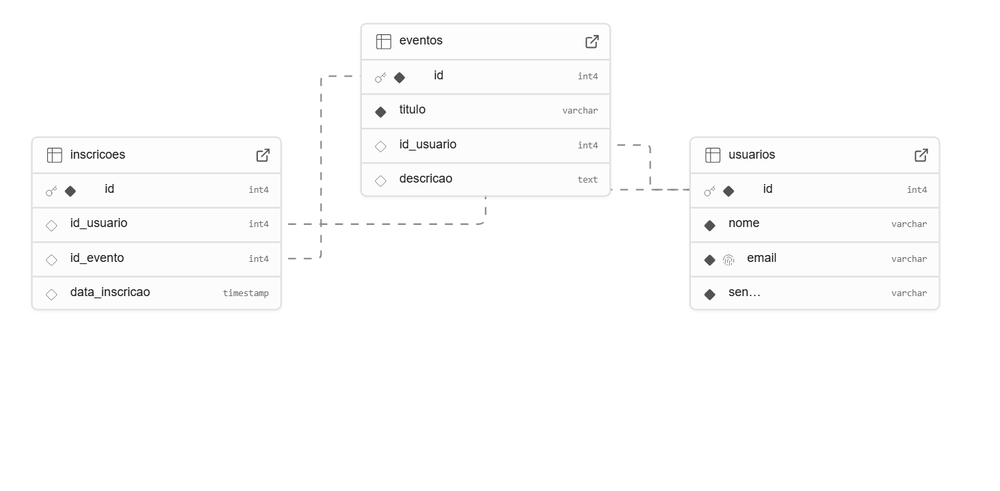

# Web Application Document - Projeto Individual - Módulo 2 - Inteli

## RolêMarcado

#### Livia Cavalcanti Oliveira

## Sumário

1. [Introdução](#c1)  
2. [Visão Geral da Aplicação Web](#c2)  
3. [Projeto Técnico da Aplicação Web](#c3)  
4. [Desenvolvimento da Aplicação Web](#c4)  
5. [Referências](#c5)  

 

## 1. Introdução 

RolêMarcado é uma plataforma web desenvolvida com Node.js e Express.js, voltada para a divulgação e inscrição em eventos, estruturada com base no padrão arquitetural MVC (Model-View-Controller). O sistema foi criado com o objetivo de facilitar o acesso a eventos públicos, permitindo que usuários encontrem e se inscrevam em atividades culturais, acadêmicas ou sociais com poucos cliques.

A aplicação oferece uma interface simples onde os usuários podem se cadastrar e navegar por uma lista de eventos disponíveis. Cada evento possui informações como título, descrição, data e local. Os usuários podem visualizar os detalhes de um evento e, caso desejem participar, realizar a inscrição diretamente pela plataforma. Todas as inscrições ficam registradas no sistema, garantindo que o usuário possa acompanhar os eventos dos quais participará.

O sistema foi desenvolvido com foco em modularidade e escalabilidade. As funcionalidades estão organizadas em camadas separadas: models para definição de dados, controllers para a lógica das requisições, e views com templates EJS para renderização de páginas. A estrutura facilita futuras expansões, como autenticação, filtros por categorias de eventos ou painéis administrativos.

Além do código, o projeto inclui um modelo lógico e físico do banco de dados, com três entidades principais: usuarios, eventos e inscricoes, interligadas por meio de chaves estrangeiras. Com isso, o RolêMarcado garante um controle claro sobre participantes e eventos.

Este sistema é o ponto de partida para uma plataforma completa de gestão de eventos, pensada para ser simples, acessível e útil para qualquer tipo de público.

A seguir é possível visualizar o modelo relacional inicial do projeto:

O modelo de banco de dados da plataforma de eventos define três relações principais. Um usuário pode criar vários eventos, mas cada evento pertence a um único usuário. Um usuário também pode se inscrever em vários eventos, e um evento pode ter várias inscrições. Essas relações são estruturadas por meio de chaves estrangeiras, permitindo a gestão de usuários, eventos e inscrições de forma eficiente.

---

## 2. Visão Geral da Aplicação Web

### 2.1. Personas (Semana 01 - opcional)

*Posicione aqui sua(s) Persona(s) em forma de texto markdown com imagens, ou como imagem de template preenchido. Atualize esta seção ao longo do módulo se necessário.*

### 2.2. User Stories (Semana 01 - opcional)

*Posicione aqui a lista de User Stories levantadas para o projeto. Siga o template de User Stories e utilize a referência USXX para numeração (US01, US02, US03, ...). Indique todas as User Stories mapeadas, mesmo aquelas que não forem implementadas ao longo do projeto. Não se esqueça de explicar o INVEST de 1 User Storie prioritária.*

---

## 3. Projeto da Aplicação Web

### 3.1. Modelagem do banco de dados  (Semana 3)

*Posicione aqui os diagramas de modelos relacionais do seu banco de dados, apresentando todos os esquemas de tabelas e suas relações. Utilize texto para complementar suas explicações, se necessário.*

*Posicione também o modelo físico com o Schema do BD (arquivo .sql)*

### 3.1.1 BD e Models (Semana 5)
*Descreva aqui os Models implementados no sistema web*

### 3.2. Arquitetura (Semana 5)

*Posicione aqui o diagrama de arquitetura da sua solução de aplicação web. Atualize sempre que necessário.*

**Instruções para criação do diagrama de arquitetura**  
- **Model**: A camada que lida com a lógica de negócios e interage com o banco de dados.
- **View**: A camada responsável pela interface de usuário.
- **Controller**: A camada que recebe as requisições, processa as ações e atualiza o modelo e a visualização.
  
*Adicione as setas e explicações sobre como os dados fluem entre o Model, Controller e View.*

### 3.3. Wireframes (Semana 03 - opcional)

*Posicione aqui as imagens do wireframe construído para sua solução e, opcionalmente, o link para acesso (mantenha o link sempre público para visualização).*

### 3.4. Guia de estilos (Semana 05 - opcional)

*Descreva aqui orientações gerais para o leitor sobre como utilizar os componentes do guia de estilos de sua solução.*

### 3.5. Protótipo de alta fidelidade (Semana 05 - opcional)

*Posicione aqui algumas imagens demonstrativas de seu protótipo de alta fidelidade e o link para acesso ao protótipo completo (mantenha o link sempre público para visualização).*

### 3.6. WebAPI e endpoints (Semana 05)

*Utilize um link para outra página de documentação contendo a descrição completa de cada endpoint. Ou descreva aqui cada endpoint criado para seu sistema.*  

### 3.7 Interface e Navegação (Semana 07)

*Descreva e ilustre aqui o desenvolvimento do frontend do sistema web, explicando brevemente o que foi entregue em termos de código e sistema. Utilize prints de tela para ilustrar.*

---

## 4. Desenvolvimento da Aplicação Web (Semana 8)

### 4.1 Demonstração do Sistema Web (Semana 8)

*VIDEO: Insira o link do vídeo demonstrativo nesta seção*
*Descreva e ilustre aqui o desenvolvimento do sistema web completo, explicando brevemente o que foi entregue em termos de código e sistema. Utilize prints de tela para ilustrar.*

### 4.2 Conclusões e Trabalhos Futuros (Semana 8)

*Indique pontos fortes e pontos a melhorar de maneira geral.*
*Relacione também quaisquer outras ideias que você tenha para melhorias futuras.*

## 5. Referências

_Incluir as principais referências de seu projeto, para que o leitor possa consultar caso ele se interessar em aprofundar._ 

---
---