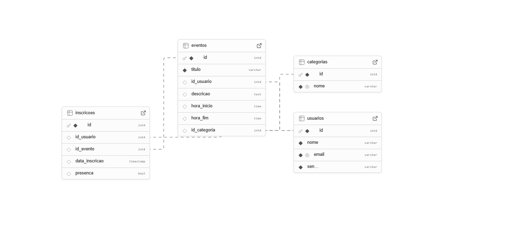

# Web Application Document - Projeto Individual - Módulo 2 - Inteli

## RolêMarcado

#### Livia Cavalcanti Oliveira

## Sumário

1. [Introdução](#c1)  
2. [Visão Geral da Aplicação Web](#c2)  
3. [Projeto Técnico da Aplicação Web](#c3)  
4. [Desenvolvimento da Aplicação Web](#c4)  
5. [Referências](#c5)  

<br>

## <a name="c1"></a>1. Introdução 

RolêMarcado é uma plataforma web desenvolvida com Node.js e Express.js, voltada para a divulgação, organização e inscrição em eventos, estruturada com base no padrão arquitetural MVC (Model-View-Controller). O sistema foi criado com o objetivo de facilitar o acesso a eventos públicos, permitindo que usuários encontrem, avaliem e se inscrevam em atividades culturais, acadêmicas ou sociais com poucos cliques.

A aplicação oferece uma interface simples onde os usuários podem se cadastrar, navegar por uma lista de eventos disponíveis, filtrá-los por categorias e visualizar informações detalhadas, como título, descrição, data, horário, local e categoria do evento. Os usuários podem também interagir por meio de comentários nos eventos, contribuindo com avaliações e opiniões. Caso desejem participar, é possível realizar a inscrição diretamente pela plataforma, com o registro da data da inscrição e controle de presença no evento.

Todas as inscrições ficam registradas no sistema, garantindo que o usuário possa acompanhar os eventos dos quais participará e que os organizadores tenham controle sobre a participação dos inscritos.

Além do código, o projeto inclui um modelo lógico e físico do banco de dados abrangente, com entidades como usuários, eventos, inscrições, categorias e comentários, interligadas por meio de chaves estrangeiras. Essa estrutura garante um controle claro e eficiente sobre participantes, eventos, avaliações e categorias.

Este sistema é o ponto de partida para uma plataforma completa de gestão de eventos, pensada para ser simples, acessível e útil para qualquer tipo de público.

---

## <a name="c2"></a>2. Visão Geral da Aplicação Web

### 2.1. Personas (Semana 01 - opcional)

*Posicione aqui sua(s) Persona(s) em forma de texto markdown com imagens, ou como imagem de template preenchido. Atualize esta seção ao longo do módulo se necessário.*

### 2.2. User Stories (Semana 01 - opcional)

*Posicione aqui a lista de User Stories levantadas para o projeto. Siga o template de User Stories e utilize a referência USXX para numeração (US01, US02, US03, ...). Indique todas as User Stories mapeadas, mesmo aquelas que não forem implementadas ao longo do projeto. Não se esqueça de explicar o INVEST de 1 User Storie prioritária.*

---

## <a name="c3"></a>3. Projeto da Aplicação Web

### 3.1. Modelagem do banco de dados  
A seguir é possível visualizar o modelo relacional inicial do projeto, assim como seu respectivo modelo físico:


``` 
CREATE TABLE usuarios ( -- cria uma tabela de usuários
  id SERIAL PRIMARY KEY, -- insere o id do usuário como uma chave primária e de incremento automático
  nome VARCHAR(100) NOT NULL, -- adiciona o campo do nome como um varchar (texto de no máximo 100 caracteres) não nulo
  email VARCHAR(100) NOT NULL UNIQUE, -- adiciona o campo do email como um varchar (texto de no máximo 100 caracteres) não nulo e único
  senha VARCHAR(255) NOT NULL -- adiciona o campo da senha como um varchar (texto de no máximo 255 caracteres) não nulo
);

CREATE TABLE eventos ( -- cria a tabela de eventos
  id SERIAL PRIMARY KEY, -- insere o id do evento como uma chave primária e de incremento automático
  titulo VARCHAR(150) NOT NULL, -- insere o campo do título do evento 
  id_usuario INT, -- insere o campo do id do usuário como um número inteiro
  descricao TEXT, -- insere o campo da descrição do evento como um texto
  hora_inicio TIME, -- insere o horário de início do evento
  hora_fim TIME, -- insere o horário de término do evento
  FOREIGN KEY (id_usuario) REFERENCES usuarios(id) -- referencia o id do usuário como uma chave estrangeira fazendo alusão a tabela (usuarios)
);


CREATE TABLE inscricoes ( -- cria a tabela de inscrições
  id SERIAL PRIMARY KEY, -- insere o id da inscrição como uma chave primária e de incremento automático
  id_usuario INT, -- insere o campo do id do usuário como um número inteiro
  id_evento INT, -- insere o campo do id do evento como um número inteiro
  data_inscricao TIMESTAMP DEFAULT CURRENT_TIMESTAMP, -- define o campo da data de inscrição com a função que retorna a data e hora atual do sistema
  presenca BOOLEAN DEFAULT false, -- indica se o usuário esteve presente no evento
  FOREIGN KEY (id_usuario) REFERENCES usuarios(id), -- referencia o id do usuário como uma chave estrangeira fazendo alusão a tabela (usuarios)
  FOREIGN KEY (id_evento) REFERENCES eventos(id) -- referencia o id do evento como uma chave estrangeira fazendo alusão a tabela (eventos)
);

CREATE TABLE categorias (
  id SERIAL PRIMARY KEY,
  nome VARCHAR(100) NOT NULL UNIQUE
);

ALTER TABLE eventos ADD COLUMN id_categoria INT;
ALTER TABLE eventos ADD FOREIGN KEY (id_categoria) REFERENCES categorias(id);

CREATE TABLE comentarios (
  id SERIAL PRIMARY KEY,
  id_usuario INT NOT NULL,
  id_evento INT NOT NULL,
  texto TEXT NOT NULL,
  data_comentario TIMESTAMP DEFAULT CURRENT_TIMESTAMP,
  FOREIGN KEY (id_usuario) REFERENCES usuarios(id),
  FOREIGN KEY (id_evento) REFERENCES eventos(id)
);

```

O modelo de banco de dados da plataforma RolêMarcado é composto por cinco entidades principais: usuários, eventos, inscrições, categorias e comentários. Cada usuário pode criar vários eventos, e cada evento está associado a um único usuário. Usuários podem se inscrever em múltiplos eventos, e cada evento pode ter diversas inscrições.

Os eventos são organizados por categorias, que permitem classificar e facilitar a busca por tipos específicos de eventos. A tabela de inscrições registra não apenas o vínculo entre usuário e evento, mas também a data da inscrição e se o participante esteve presente no evento, por meio de um campo booleano.

Além disso, a plataforma conta com um sistema de comentários, onde usuários podem deixar avaliações e opiniões sobre os eventos, registrando o texto do comentário e a data em que foi realizado.

Todas essas relações são mantidas por meio de chaves estrangeiras, garantindo a integridade e consistência dos dados entre usuários, eventos, inscrições, categorias e comentários, proporcionando uma gestão eficiente e organizada da plataforma.

### 3.1.1 BD e Models (Semana 5)
*Descreva aqui os Models implementados no sistema web*

### 3.2. Arquitetura (Semana 5)

*Posicione aqui o diagrama de arquitetura da sua solução de aplicação web. Atualize sempre que necessário.*

**Instruções para criação do diagrama de arquitetura**  
- **Model**: A camada que lida com a lógica de negócios e interage com o banco de dados.
- **View**: A camada responsável pela interface de usuário.
- **Controller**: A camada que recebe as requisições, processa as ações e atualiza o modelo e a visualização.
  
*Adicione as setas e explicações sobre como os dados fluem entre o Model, Controller e View.*

### 3.3. Wireframes (Semana 03 - opcional)

*Posicione aqui as imagens do wireframe construído para sua solução e, opcionalmente, o link para acesso (mantenha o link sempre público para visualização).*

### 3.4. Guia de estilos (Semana 05 - opcional)

*Descreva aqui orientações gerais para o leitor sobre como utilizar os componentes do guia de estilos de sua solução.*


### 3.5. Protótipo de alta fidelidade (Semana 05 - opcional)

*Posicione aqui algumas imagens demonstrativas de seu protótipo de alta fidelidade e o link para acesso ao protótipo completo (mantenha o link sempre público para visualização).*

### 3.6. WebAPI e endpoints (Semana 05)

*Utilize um link para outra página de documentação contendo a descrição completa de cada endpoint. Ou descreva aqui cada endpoint criado para seu sistema.*  

### 3.7 Interface e Navegação (Semana 07)

*Descreva e ilustre aqui o desenvolvimento do frontend do sistema web, explicando brevemente o que foi entregue em termos de código e sistema. Utilize prints de tela para ilustrar.*

---

## <a name="c4"></a>4. Desenvolvimento da Aplicação Web (Semana 8)

### 4.1 Demonstração do Sistema Web (Semana 8)

*VIDEO: Insira o link do vídeo demonstrativo nesta seção*
*Descreva e ilustre aqui o desenvolvimento do sistema web completo, explicando brevemente o que foi entregue em termos de código e sistema. Utilize prints de tela para ilustrar.*

### 4.2 Conclusões e Trabalhos Futuros (Semana 8)

*Indique pontos fortes e pontos a melhorar de maneira geral.*
*Relacione também quaisquer outras ideias que você tenha para melhorias futuras.*


## <a name="c5"></a>5. Referências

_Incluir as principais referências de seu projeto, para que o leitor possa consultar caso ele se interessar em aprofundar._<br>

---
---