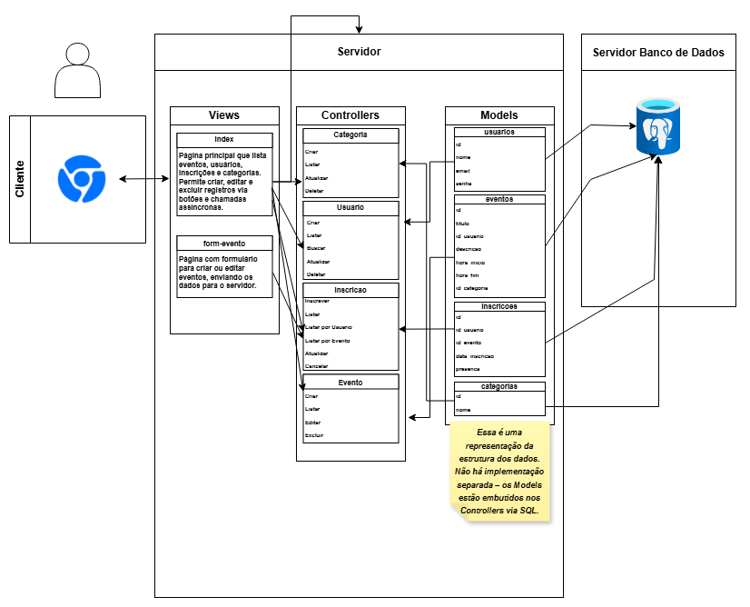

# Web Application Document - Projeto Individual - Módulo 2 - Inteli

## RolêMarcado

#### Livia Cavalcanti Oliveira

## Sumário

1. [Introdução](#c1)  
2. [Visão Geral da Aplicação Web](#c2)  
3. [Projeto Técnico da Aplicação Web](#c3)  
4. [Desenvolvimento da Aplicação Web](#c4)  
5. [Referências](#c5)  

<br>

## <a name="c1"></a>1. Introdução 

RolêMarcado é uma plataforma web desenvolvida com Node.js e Express.js, voltada para a divulgação, organização e inscrição em eventos, estruturada com base no padrão arquitetural MVC (Model-View-Controller). O sistema foi criado com o objetivo de facilitar o acesso a eventos públicos, permitindo que usuários encontrem, avaliem e se inscrevam em atividades culturais, acadêmicas ou sociais com poucos cliques.

A aplicação oferece uma interface simples onde os usuários podem se cadastrar, navegar por uma lista de eventos disponíveis, filtrá-los por categorias e visualizar informações detalhadas, como título, descrição, data, horário, local e categoria do evento. Caso desejem participar, é possível realizar a inscrição diretamente pela plataforma, com o registro da data da inscrição e controle de presença no evento.

Todas as inscrições ficam registradas no sistema, garantindo que o usuário possa acompanhar os eventos dos quais participará e que os organizadores tenham controle sobre a participação dos inscritos.

Além do código, o projeto inclui um modelo lógico e físico do banco de dados abrangente, com entidades como usuários, eventos, inscrições, categorias e comentários, interligadas por meio de chaves estrangeiras. Essa estrutura garante um controle claro e eficiente sobre participantes, eventos, inscrições e categorias.

Este sistema é o ponto de partida para uma plataforma completa de gestão de eventos, pensada para ser simples, acessível e útil para qualquer tipo de público.

---

## <a name="c2"></a>2. Visão Geral da Aplicação Web

### 2.1. Personas (Semana 01 - opcional)

*Posicione aqui sua(s) Persona(s) em forma de texto markdown com imagens, ou como imagem de template preenchido. Atualize esta seção ao longo do módulo se necessário.*

### 2.2. User Stories (Semana 01 - opcional)

*Posicione aqui a lista de User Stories levantadas para o projeto. Siga o template de User Stories e utilize a referência USXX para numeração (US01, US02, US03, ...). Indique todas as User Stories mapeadas, mesmo aquelas que não forem implementadas ao longo do projeto. Não se esqueça de explicar o INVEST de 1 User Storie prioritária.*

---

## <a name="c3"></a>3. Projeto da Aplicação Web

### 3.1. Modelagem do banco de dados  
A seguir é possível visualizar o modelo relacional inicial do projeto, assim como seu respectivo modelo físico:


``` 
CREATE TABLE usuarios (
  id SERIAL PRIMARY KEY,
  nome VARCHAR(100) NOT NULL,
  email VARCHAR(100) NOT NULL UNIQUE,
  senha VARCHAR(255) NOT NULL
);

CREATE TABLE eventos ( -- cria a tabela de eventos
  id SERIAL PRIMARY KEY, -- insere o id do evento como uma chave primária e de incremento automático
  titulo VARCHAR(150) NOT NULL, -- insere o campo do título do evento 
  id_usuario INT, -- insere o campo do id do usuário como um número inteiro
  descricao TEXT, -- insere o campo da descrição do evento como um texto
  hora_inicio TIME, -- insere o horário de início do evento
  hora_fim TIME, -- insere o horário de término do evento
  FOREIGN KEY (id_usuario) REFERENCES usuarios(id) -- referencia o id do usuário como uma chave estrangeira fazendo alusão a tabela (usuarios)
);

CREATE TABLE inscricoes ( -- cria a tabela de inscrições
  id SERIAL PRIMARY KEY, -- insere o id da inscrição como uma chave primária e de incremento automático
  id_usuario INT, -- insere o campo do id do usuário como um número inteiro
  id_evento INT, -- insere o campo do id do evento como um número inteiro
  data_inscricao TIMESTAMP DEFAULT CURRENT_TIMESTAMP, -- define o campo da data de inscrição com a função que retorna a data e hora atual do sistema
  presenca BOOLEAN DEFAULT false, -- indica se o usuário esteve presente no evento
  FOREIGN KEY (id_usuario) REFERENCES usuarios(id), -- referencia o id do usuário como uma chave estrangeira fazendo alusão a tabela (usuarios)
  FOREIGN KEY (id_evento) REFERENCES eventos(id) -- referencia o id do evento como uma chave estrangeira fazendo alusão a tabela (eventos)
);

CREATE TABLE categorias (
  id SERIAL PRIMARY KEY,
  nome VARCHAR(100) NOT NULL UNIQUE
);

ALTER TABLE eventos ADD COLUMN id_categoria INT;
ALTER TABLE eventos ADD FOREIGN KEY (id_categoria) REFERENCES categorias(id);

INSERT INTO usuarios (nome, email, senha)
VALUES ('João da Silva', 'joao@email.com', 'senha123');

SELECT * FROM usuarios WHERE id = 1;

UPDATE usuarios
SET nome = 'João Pedro da Silva', email = 'joaopedro@email.com'
WHERE id = 1;

DELETE FROM usuarios
WHERE id = 1; 
```

O modelo de banco de dados da plataforma RolêMarcado é composto por cinco entidades principais: usuários, eventos, inscrições, categorias e comentários. Cada usuário pode criar vários eventos, e cada evento está associado a um único usuário. Usuários podem se inscrever em múltiplos eventos, e cada evento pode ter diversas inscrições.

Os eventos são organizados por categorias, que permitem classificar e facilitar a busca por tipos específicos de eventos. A tabela de inscrições registra não apenas o vínculo entre usuário e evento, mas também a data da inscrição e se o participante esteve presente no evento, por meio de um campo booleano.

Todas essas relações são mantidas por meio de chaves estrangeiras, garantindo a integridade e consistência dos dados entre usuários, eventos, inscrições e categorias, proporcionando uma gestão eficiente e organizada da plataforma.

### 3.1.1 BD e Models 

Mesmo sem usar um ORM como o Sequelize, os models estão representados nas consultas SQL feitas nos controllers. Abaixo, mostramos como cada entidade é estruturada, com base nas operações de criação, leitura, atualização e remoção.

---

#### Usuário (`usuarios`)

- **Campos:**
  - `id`: inteiro, chave primária
  - `nome`: texto, obrigatório
  - `email`: texto, único e obrigatório
  - `senha`: texto, obrigatório

- **Operações:**
  - Criar: `INSERT INTO usuarios (...)`
  - Listar: `SELECT id, nome, email FROM usuarios`
  - Buscar por ID: `SELECT ... WHERE id = $1`
  - Atualizar: `UPDATE usuarios SET ... WHERE id = $1`
  - Deletar: `DELETE FROM usuarios WHERE id = $1`

---

#### Categoria (`categorias`)

- **Campos:**
  - `id`: inteiro, chave primária
  - `nome`: texto, obrigatório

- **Operações:**
  - Criar: `INSERT INTO categorias (nome) VALUES ($1)`
  - Listar: `SELECT * FROM categorias`
  - Atualizar: `UPDATE categorias SET nome = $1 WHERE id = $2`
  - Deletar: `DELETE FROM categorias WHERE id = $1`

---

#### Evento (`eventos`)

- **Campos:**
  - `id`: inteiro, chave primária
  - `titulo`: texto, obrigatório
  - `descricao`: texto
  - `hora_inicio`: timestamp
  - `hora_fim`: timestamp
  - `id_usuario`: inteiro, chave estrangeira para `usuarios`
  - `id_categoria`: inteiro, chave estrangeira para `categorias`

- **Operações:**
  - Criar: `INSERT INTO eventos (...)`
  - Listar: `SELECT * FROM eventos`
  - Atualizar: `UPDATE eventos SET ...`
  - Deletar: `DELETE FROM eventos WHERE id = $1`

---

#### Comentário (`comentarios`)

- **Campos:**
  - `id`: inteiro, chave primária
  - `id_usuario`: inteiro, chave estrangeira
  - `id_evento`: inteiro, chave estrangeira
  - `texto`: texto
  - `data_comentario`: timestamp (pode ser default)

- **Operações:**
  - Criar: `INSERT INTO comentarios (...)`
  - Listar todos: `SELECT * FROM comentarios`
  - Listar por evento: `SELECT * FROM comentarios WHERE id_evento = $1`
  - Deletar: `DELETE FROM comentarios WHERE id = $1`

---

#### Inscrição (`inscricoes`)

- **Campos:**
  - `id`: inteiro, chave primária
  - `id_usuario`: inteiro, chave estrangeira
  - `id_evento`: inteiro, chave estrangeira
  - `presenca`: boolean (pode ser nulo inicialmente)

- **Operações:**
  - Criar: `INSERT INTO inscricoes (...)`
  - Listar: `SELECT * FROM inscricoes`
  - Listar por usuário: `SELECT * FROM inscricoes WHERE id_usuario = $1`
  - Listar por evento: `SELECT * FROM inscricoes WHERE id_evento = $1`
  - Atualizar presença: `UPDATE inscricoes SET presenca = $1 WHERE id = $2`
  - Deletar: `DELETE FROM inscricoes WHERE id = $1`


### 3.2. Arquitetura 

Um diagrama de arquitetura é um desenho técnico que mostra como as partes de um sistema de software estão organizadas e se comunicam. Ele ajuda a visualizar a estrutura geral da aplicação, facilitando o entendimento do funcionamento do sistema, mesmo antes da implementação. É uma ferramenta essencial para planejar, documentar e comunicar a estrutura do sistema entre desenvolvedores e outros envolvidos no projeto. Nesse projeto em específico, o diagrama serviu para mostrar a relação entre models, views e controllers, evidenciando como esses componentes interagem para garantir o fluxo de dados e a comunicação entre a interface do usuário e a lógica de negócio, como evidenciado abaixo:



### 3.3. Wireframes (Semana 03 - opcional)

*Posicione aqui as imagens do wireframe construído para sua solução e, opcionalmente, o link para acesso (mantenha o link sempre público para visualização).*

### 3.4. Guia de estilos (Semana 05 - opcional)

*Descreva aqui orientações gerais para o leitor sobre como utilizar os componentes do guia de estilos de sua solução.*


### 3.5. Protótipo de alta fidelidade (Semana 05 - opcional)

*Posicione aqui algumas imagens demonstrativas de seu protótipo de alta fidelidade e o link para acesso ao protótipo completo (mantenha o link sempre público para visualização).*

### 3.6. WebAPI e endpoints 

A seguir, estão listados os principais endpoints da API do projeto, com seus métodos, URLs, finalidades e parâmetros para facilitar o uso do sistema.

#### Usuários

| Método | Endpoint          | Descrição                      | Parâmetros / Corpo                              |
|--------|-------------------|--------------------------------|------------------------------------------------|
| POST   | `/usuarios`       | Criar um novo usuário          | Corpo JSON: `{ nome, email, senha, ... }`      |
| GET    | `/usuarios`       | Listar todos os usuários       | -                                              |
| GET    | `/usuarios/:id`   | Buscar usuário pelo ID         | Parâmetro URL: `id` (ID do usuário)             |
| PUT    | `/usuarios/:id`   | Atualizar dados do usuário     | Parâmetro URL: `id` <br> Corpo JSON com campos a atualizar |
| DELETE | `/usuarios/:id`   | Deletar usuário pelo ID        | Parâmetro URL: `id`                             |

#### Eventos

| Método | Endpoint          | Descrição                      | Parâmetros / Corpo                              |
|--------|-------------------|--------------------------------|------------------------------------------------|
| POST   | `/eventos`        | Criar um novo evento           | Corpo JSON: `{ titulo, descricao, data, categoriaId, ... }` |
| GET    | `/eventos`        | Listar todos os eventos        | -                                              |
| PUT    | `/eventos/:id`    | Editar um evento pelo ID       | Parâmetro URL: `id` <br> Corpo JSON com campos a atualizar |
| DELETE | `/eventos/:id`    | Excluir evento pelo ID         | Parâmetro URL: `id`                             |

#### Inscrições

| Método | Endpoint                     | Descrição                                   | Parâmetros / Corpo                                |
|--------|------------------------------|---------------------------------------------|--------------------------------------------------|
| POST   | `/inscricoes`                | Inscrever um usuário em um evento           | Corpo JSON: `{ usuarioId, eventoId, ... }`       |
| GET    | `/inscricoes`                | Listar todas as inscrições                   | -                                                |
| GET    | `/inscricoes/usuario/:idUsuario` | Listar inscrições de um usuário específico  | Parâmetro URL: `idUsuario`                        |
| GET    | `/inscricoes/evento/:idEvento`   | Listar inscrições de um evento específico    | Parâmetro URL: `idEvento`                         |
| PUT    | `/inscricoes/:id`            | Atualizar presença ou dados da inscrição    | Parâmetro URL: `id` <br> Corpo JSON com dados a atualizar |
| DELETE | `/inscricoes/:id`            | Cancelar inscrição pelo ID                   | Parâmetro URL: `id`                               |

#### Categorias

| Método | Endpoint          | Descrição                       | Parâmetros / Corpo                              |
|--------|-------------------|---------------------------------|------------------------------------------------|
| POST   | `/categorias`     | Criar uma nova categoria        | Corpo JSON: `{ nome, descricao }`               |
| GET    | `/categorias`     | Listar todas as categorias      | -                                              |
| PUT    | `/categorias/:id` | Atualizar categoria pelo ID     | Parâmetro URL: `id` <br> Corpo JSON com dados a atualizar |
| DELETE | `/categorias/:id` | Deletar categoria pelo ID       | Parâmetro URL: `id`                             |

### 3.7 Interface e Navegação (Semana 07)

*Descreva e ilustre aqui o desenvolvimento do frontend do sistema web, explicando brevemente o que foi entregue em termos de código e sistema. Utilize prints de tela para ilustrar.*

---

## <a name="c4"></a>4. Desenvolvimento da Aplicação Web (Semana 8)

### 4.1 Demonstração do Sistema Web (Semana 8)

*VIDEO: Insira o link do vídeo demonstrativo nesta seção*
*Descreva e ilustre aqui o desenvolvimento do sistema web completo, explicando brevemente o que foi entregue em termos de código e sistema. Utilize prints de tela para ilustrar.*

### 4.2 Conclusões e Trabalhos Futuros (Semana 8)

*Indique pontos fortes e pontos a melhorar de maneira geral.*
*Relacione também quaisquer outras ideias que você tenha para melhorias futuras.*


## <a name="c5"></a>5. Referências
